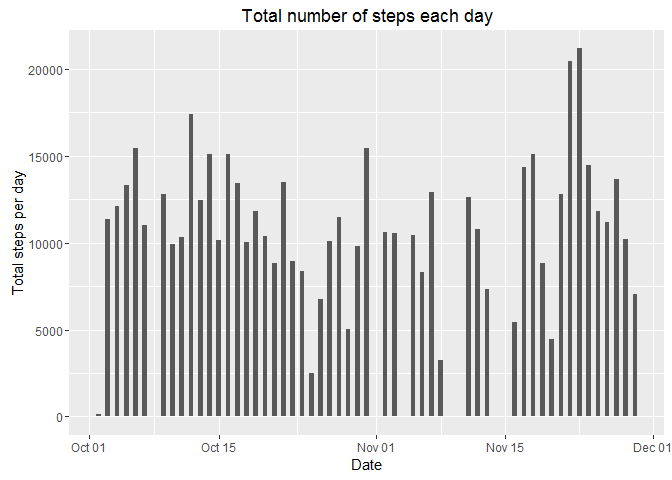
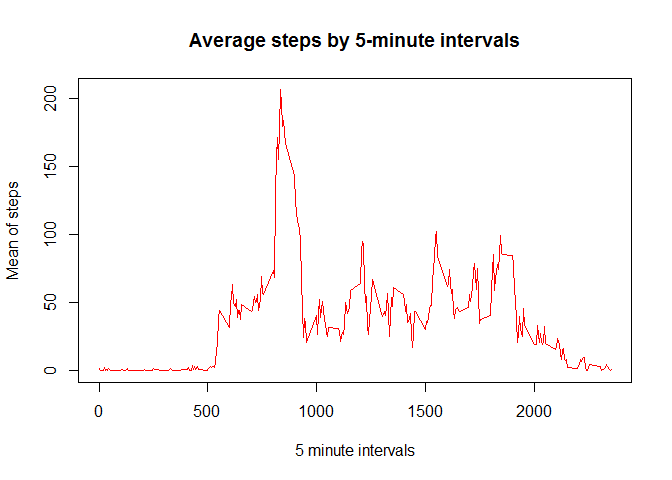
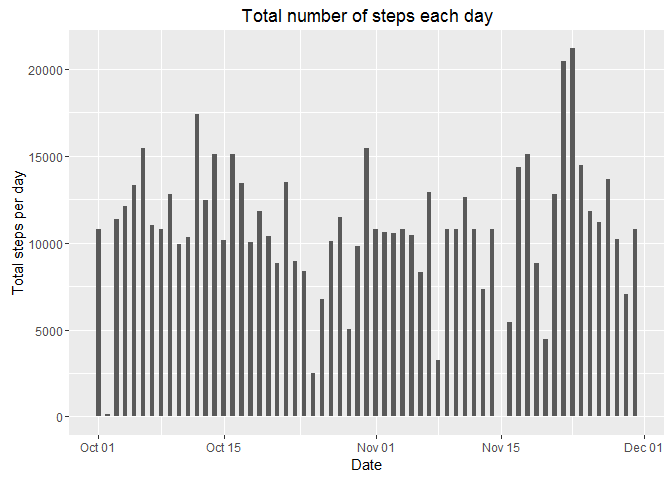

# Reproducible Research Project 1

###Loading and preprocessing the data

####1. Load the data (i.e. read.csv())
The code first checks to see whether a folder called "Reproducible Research" (subDir) exists and if it does sets
it as the working directory. If the folder does not exists the code creates it. Note: The MainDir must exist.

```r
MainDir<-"C:/Coursera"
SubDir<-"RR_Project1"

if(file.exists(file.path(MainDir,SubDir))){
  setwd(file.path(MainDir,SubDir))
} else {
  dir.create(file.path(MainDir,SubDir))
  setwd(file.path(MainDir,SubDir))
}
```

This downloads the data and unzips the file.

```r
zipname <- "getdata_project1.zip"
if (!file.exists(zipname)){
  fileURL <- "https://d396qusza40orc.cloudfront.net/repdata%2Fdata%2Factivity.zip"
  download.file(fileURL, zipname)
}  

if (!file.exists("activity")) { 
  unzip(zipname) 
}
```

####2. Process/transform the data (if necessary) into a format suitable for your analysis
It loads the data into R using the data.table package. It also converts the date column into a date.

```r
library(data.table)
activity<-fread("activity.csv")
activity$date<-as.Date(activity$date,"%Y-%m-%d")
```


###Loading and preprocessing the data

####1. Calculate the total number of steps taken per day
Below code removes NAs and calculates the total number of steps per day.  

```r
steps<-activity[!is.na(steps),]
steps<-aggregate(steps$steps,by = list(steps$date),sum)
colnames(steps)<-c("date","steps")
sum(steps$steps)
```

```
## [1] 570608
```

####2. If you do not understand the difference between a histogram and a barplot, research the difference between them. Make a histogram of the total number of steps taken each day
This code creates a histogram of total steps per day over time using ggplot2.

```r
library(ggplot2)
ggplot(steps) + geom_histogram(aes(x=date, weight=steps), binwidth=.5) + 
  ggtitle("Total number of steps each day") + labs(x="Date",y="Total steps per day") 
```

<!-- -->

####3. Calculate and report the mean and median of the total number of steps taken per day
Calculates the mean and median of total number of steps taken each day

```r
meansteps<-mean(steps$steps)
mediansteps<-median(steps$steps)
meansteps
```

```
## [1] 10766.19
```

```r
mediansteps
```

```
## [1] 10765
```


###What is the average daily activity pattern?

####1. Make a time series plot (i.e. type = "l") of the 5-minute interval (x-axis) and the average number of steps taken, averaged across all days (y-axis)

```r
meansteps_interval <- data.table(aggregate(steps~interval,data=activity[!is.na(steps),],FUN=mean))
plot(meansteps_interval,type="l",col="red",main="Average steps by 5-minute intervals",xlab="5 minute intervals",ylab="Mean of steps")
```

<!-- -->

####2. Which 5-minute interval, on average across all the days in the dataset, contains the maximum number of steps?
Interval 835 contains on average the most number of steps.

```r
meansteps_interval[steps== max(steps)]
```

```
##    interval    steps
## 1:      835 206.1698
```


###Imputing missing values

####1. Calculate and report the total number of missing values in the dataset (i.e. the total number of rows with NAs)
There are  2304 missing values

```r
colSums(is.na(activity))
```

```
##    steps     date interval 
##     2304        0        0
```

####2. Devise a strategy for filling in all of the missing values in the dataset. The strategy does not need to be sophisticated. For example, you could use the mean/median for that day, or the mean for that 5-minute interval, etc.

The strategy being used is the mean for that 5-minute interval.

####3. Create a new dataset that is equal to the original dataset but with the missing data filled in.
The below code creates a new activity dataset with the NAs filled in with the mean of the interval.

```r
activity_new<-activity
for(i in 1:nrow(activity_new)){
  if(is.na(activity_new$steps)[i])
    activity_new$steps[i]<-meansteps_interval[meansteps_interval$interval %in% activity_new$interval[i],c("steps"),with=FALSE]
  else 
    activity_new$steps[i]<- activity_new$steps[i]
}
activity_new$steps<-as.numeric(activity_new$steps)
```

####4. Make a histogram of the total number of steps taken each day and Calculate and report the mean and median total number of steps taken per day. Do these values differ from the estimates from the first part of the assignment? What is the impact of imputing missing data on the estimates of the total daily number of steps?
The below is code for the histogram with the filled in NAs.

```r
ggplot(activity_new) + geom_histogram(aes(x=date, weight=steps), binwidth=.5) + 
  ggtitle("Total number of steps each day") + labs(x="Date",y="Total steps per day") 
```

<!-- -->

The mean and median are both equal to 10766.19. Therefore imputing the values with the mean has resulted in the mean and median being the same. The below code aggregates by steps by day and then calculates the mean and median.

```r
steps_new<-aggregate(activity_new$steps,by = list(activity_new$date),sum)
colnames(steps_new)<-c("date","steps")
mean(steps_new$steps)
```

```
## [1] 10766.19
```

```r
median(steps_new$steps)
```

```
## [1] 10766.19
```


###Are there differences in activity patterns between weekdays and weekends?

####1. Create a new factor variable in the dataset with two levels - "weekday" and "weekend" indicating whether a given date is a weekday or weekend day.

```r
activity_new$date_type<-ifelse(weekdays(activity_new$date)=="Saturday"|weekdays(activity_new$date)=="Sunday","Weekend","Weekday")
activity_new$date_type<-factor(activity_new$date_type)
```

####2. Make a panel plot containing a time series plot (i.e. type = "l") of the 5-minute interval (x-axis) and the average number of steps taken, averaged across all weekday days or weekend days (y-axis). See the README file in the GitHub repository to see an example of what this plot should look like using simulated data.

```r
meansteps_new <- aggregate(activity_new$steps, by = list(activity_new$interval, activity_new$date_type),mean)
colnames(meansteps_new)<-c("interval","date_type","mean_steps")

library(lattice)
xyplot(mean_steps ~ interval | date_type , meansteps_new, type = "l", layout = c(1, 2),xlab = "Interval", ylab = "Number of steps")
```

<!-- -->
